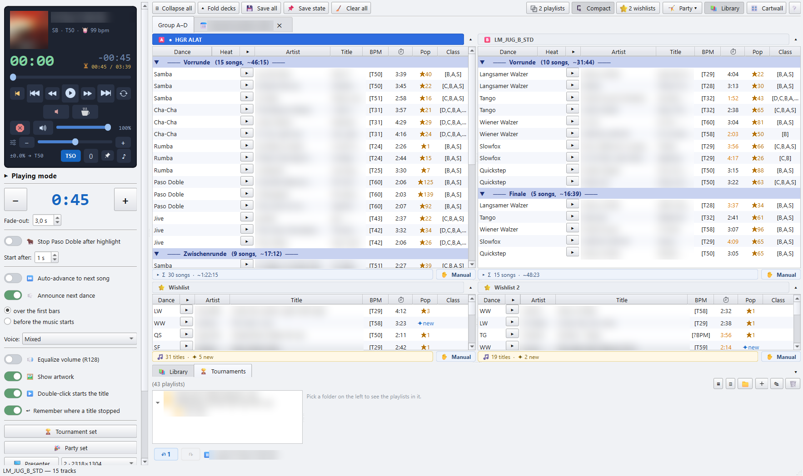

# DanceSport Player

A desktop music player for ballroom and Latin dance events: it runs the music of
a dancesport tournament or a dance party from the music desk.

- Up to four playlist decks plus wishlists, with drag and drop to other apps
  (e.g. a DJ program or Explorer).
- Auto-advance or manual mode per list, a fixed play length per title with
  fade-out, and a countdown to the end of the music.
- Loudness levelling (EBU R128 through ffmpeg) and an optional pitch to the
  official TSO tempo of each dance.
- Spoken dance announcements before or over the music.
- Cartwall with pads for jingles and fanfares.
- Paso Doble highlight stops and pause music.
- Presenter window for a second screen: the current dance and the running order,
  with themes.
- Tournament and party play sets: one press puts every control on the values a
  heat or a party list is run with.

The user interface is in English and German, with a light and a dark theme.
It runs on Windows, macOS and Linux. Windows is the main platform, the one the
player is used on at events; the macOS and Linux builds are newer and less
tested.



## Download

Ready-to-run builds are on the [Releases](../../releases/latest) page, one
download per platform (two for Linux):

- **DanceSport-Player-…-windows.zip**: unzip the folder and start
  `DanceSport-Player.exe`. ffmpeg is bundled.
- **DanceSport-Player-…-macos.dmg**: drag the app onto Applications. Signed ad
  hoc, not notarized. ffmpeg is not bundled there: `brew install ffmpeg`.
- **DanceSport-Player-…-linux-x86_64.tar.gz** (Intel/AMD PCs) or
  **…-linux-arm64.tar.gz** (ARM, e.g. Asahi Linux): unpack the folder and start
  `DanceSport-Player`. Built on Ubuntu 22.04 and 24.04. ffmpeg is not bundled:
  `sudo apt install ffmpeg` (Arch: `sudo pacman -S ffmpeg`).

How to install and open each one, including the first start past SmartScreen
and Gatekeeper: [Windows](docs/install/windows.md), [macOS](docs/install/macos.md),
[Linux](docs/install/linux.md). Every download carries its guide as `README.txt`.

## Running from source

- **Python 3.14 or newer.** The code relies on PEP 649 lazy annotations.
- **ffmpeg** for MP3 decoding, loudness and silence detection. Put it on `PATH`
  (`winget install Gyan.FFmpeg` on Windows, `brew install ffmpeg` on macOS,
  `sudo apt install ffmpeg` on Debian/Ubuntu, `sudo pacman -S ffmpeg` on Arch)
  or, on Windows, place the
  extracted build in an `ffmpeg*` folder next to the app.

```powershell
git clone <repo-url> dancesport-player
cd dancesport-player
py -3.14 -m venv .venv
.venv\Scripts\pip install -r requirements-player.txt
.venv\Scripts\python.exe dancesport_gui.py
```

On macOS and Linux:

```sh
python3.14 -m venv .venv
.venv/bin/pip install -r requirements-player.txt
.venv/bin/python dancesport_gui.py
```

On first start the app asks how you want to use it; pick **Player only**.

The [user manual](docs/manual/README.md) describes the player, and
[Playing the evening](docs/manual/04-playing.md) covers running the music on
the floor.

## Building the app

See [BUILD.md](BUILD.md): `build_player.bat` builds the player as a PyInstaller
one-folder app on Windows, `./build_app.sh player` a `.app` bundle on macOS
and `./build_linux.sh player` a one-folder app on Linux (`./build_linux.sh
player tar` packs it as a tar.gz as well).

The [build-player](.github/workflows/build-player.yml) workflow builds all three
and publishes them as a release for every `v*` tag.

## Development

```powershell
.venv\Scripts\python.exe -m unittest discover -p "test_*.py"
.venv\Scripts\python.exe -m unittest tests.player.test_cartwall -v   # one module
.venv\Scripts\python.exe -m ruff check .
```

The full test suite needs `requirements.txt`. Tests are plain `unittest`;
GUI tests drive Qt through its offscreen platform, so no window opens.
Enable the git hooks once per clone with `git config core.hooksPath .githooks`.

| Path | Contents |
|---|---|
| `dancesport_gui.py` | launcher and main window, PyInstaller entry point |
| `player/` | playback, cartwall, announcements, presenter, taskbar |
| `gui/`, `shared/` | decks, tables, drag and drop, dialogs |
| `planner/` | library scan, parsing, database, `.m3u`. No Qt |
| `speech/` | the spoken dance announcements |

## License

[MIT](LICENSE) © marcelkb

The libraries the app is built on, and the ffmpeg bundled with the Windows
build, keep their own licenses; see
[THIRD_PARTY_LICENSES.md](THIRD_PARTY_LICENSES.md).

The icons are Bootstrap Icons (MIT) and one Twemoji-derived icon (CC-BY 4.0);
see [ICONS-LICENSE.txt](ICONS-LICENSE.txt).

The dance announcement recordings were generated with
[elevenlabs.io](https://elevenlabs.io) and are **not** under the MIT license:
non-commercial use only, see [speech/LICENSE-AUDIO.md](speech/LICENSE-AUDIO.md).
