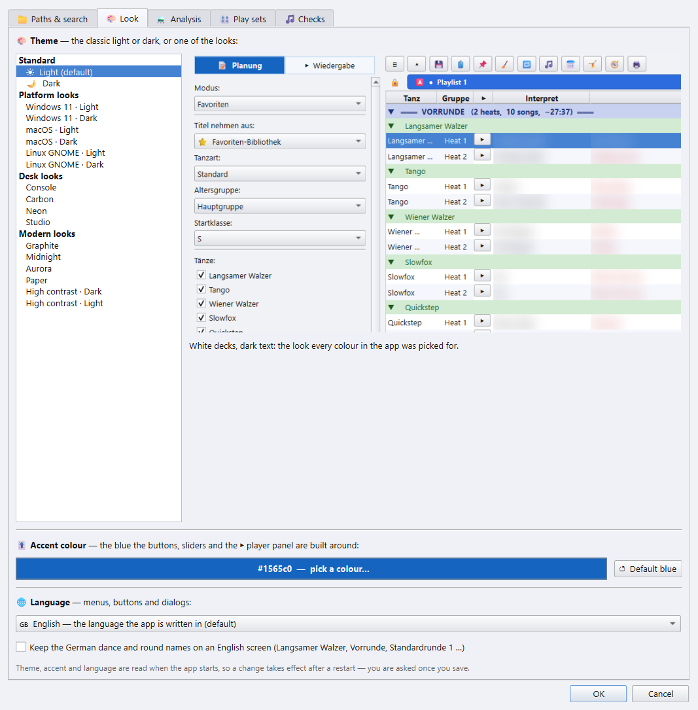
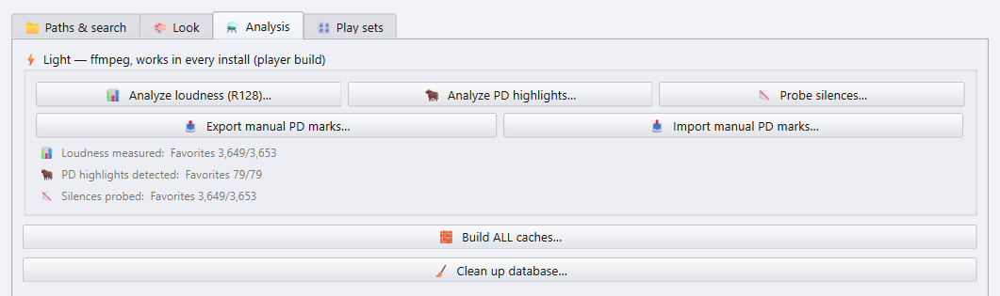
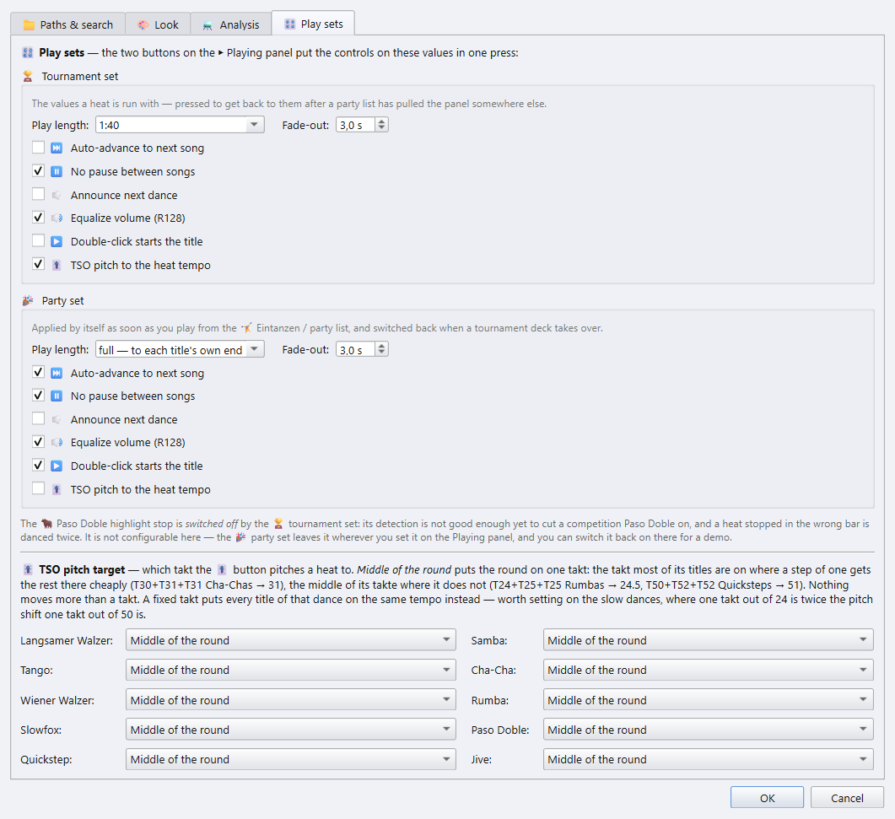

# 6 · Settings

[Manual index](README.md) · previous: [Tags](05-tags.md)

Open **⚙ Settings** from the bottom of the Playing panel. The changes apply
when you click **OK**. Theme, accent colour, language and the audio backend
are read at start: for those the app asks for a restart.

## Paths and search

The **📁 Paths & search** tab.

The folders on top are described in
[chapter 1](01-getting-started.md#point-the-app-at-your-music). Under them:

| Setting | Does |
|---|---|
| **▶ Player position** | Where the player card stands: *beside the playlists*, at the head of the Playing panel, or *above the playlists*, as one wide strip over the decks. |
| **🎙 Advanced voice controls** | Shows *…with takt*, *…with heat* and *🔈 Test* under *Announce next dance*. Hidden, they keep their values. |
| **🔊 Audio backend** | The engine every title is played through. On Windows: *FFmpeg* (the default) or *Windows Media Foundation*. Only change it when a title won't play or a tempo change leaves a gap. Takes effect after a restart. |
| **🔇 Release the sound card between titles** | An onboard sound card puts a hiss on the PA while an app holds it open. This hands the device back after a few seconds of silence. The price is a soft click when the next title starts, so switch it on only if you hear the hiss. |
| **🔕 Mute system sounds while the evening runs** | No error ding or notification chime over the speakers. The system sounds come back when you close the app. |

## Look

The **🎨 Look** tab.

- **🎨 Theme**: a list of every look, each with a picture of the main window
  in it beside the list.
  - **Standard**: the classic *Light*, the default, and *Dark* for a dim hall.
    They keep the emoji on the buttons and take the accent colour below.
  - **Platform looks**: Windows 11, macOS and Linux GNOME, each light and
    dark. Every look can be picked on every system.
  - **Desk looks**: *Console*, *Carbon*, *Neon* and *Studio*, dark like a
    mixing desk.
  - **Modern looks**: *Graphite*, *Midnight*, *Aurora*, *Paper* and two
    high-contrast looks, picked for readability first.

  A look restyles the buttons, fields, tabs and menus, brings its own font and
  accent colour, and swaps the button emoji for drawn icons. Warnings stay red
  in every theme.
  - **Own looks**: looks you make yourself, kept on this computer.
    **＋ New look…** copies the selected look (*Light* and *Dark* start from
    *Paper* and *Graphite*) and opens the editor: every colour, the corners, the
    button, tab and focus style and the font, with a live preview beside them.
    Text that reads too faintly against its ground is listed as a warning.
    **✎ Edit…** and **🗑 Delete** change or remove an own look, **Export…**
    saves one as a `.json` file and **Import…** adds one someone passed on.
    These buttons save at once. Changing the look the app runs in offers a
    restart when you close the settings with OK.
- **🎚 Accent colour**: the blue of the buttons, sliders and the player panel,
  for *Light* and *Dark*.
  **↺ Default blue** resets it. Colours that mean something, such as red
  warnings, keep their hue.
- **🌐 Language**: English or German.

All three take effect after a restart.

## Analysis

The **⚗ Analysis** tab collects every analysis. It only *reads* your files.
Everything is cached, so a second run only does what is new.

The player needs three of them:

- **📊 Analyze loudness (R128)**: for *Equalize volume*.
- **🐂 Analyze PD highlights**: for the Paso Doble stop.
- **🔇 Probe silences**: for skipping silence at the start and end.

**📤 Export / 📥 Import manual PD marks** carries the highlights you marked by
hand to another PC. Run from the full app, the tab lists more analyses; the
player build shows only these.

**🧱 Build ALL caches…** runs every analysis in turn, for a library you
choose. It can be cancelled.

**🧹 Clean up database…** removes cached rows for files that no longer exist
and compacts the database. It refuses to run when the music drive looks
unmounted, so the analysis can't be wiped by accident.

## Play sets

The **🎛 Play sets** tab sets what the **🏆 Tournament set** and **🎉 Party
set** buttons of the Playing panel apply (see
[chapter 4](04-playing.md#play-sets)).

For each set:

- **Play length**: pick one, type `m:ss` or seconds, or choose *full*.
- **Fade-out**, in half-second steps.
- **⏭ Auto-advance**, **⏸ No pause between songs**, **🔈 Announce next
  dance**, **🔊 Equalize volume**, **▶️ Double-click starts the title** and
  **🎚 TSO pitch to the heat tempo**.

The tournament set always switches the 🐂 Paso Doble stop off: the detection
is not reliable enough to cut a competition Paso Doble. The party set leaves
it as it is.

**🎚 TSO pitch target** sets, per dance, the tempo the TSO button pitches a
heat to:

- **Middle of the round**: puts the whole round on one tempo, where most of
  its titles already are. No title moves more than one bar per minute.
- **Lower / Middle / Upper**: a fixed tempo within the TSO range. This is
  worth setting for the slow dances, where one bar per minute is a much
  bigger pitch change.

Next: [Keyboard and mouse](07-shortcuts.md)
