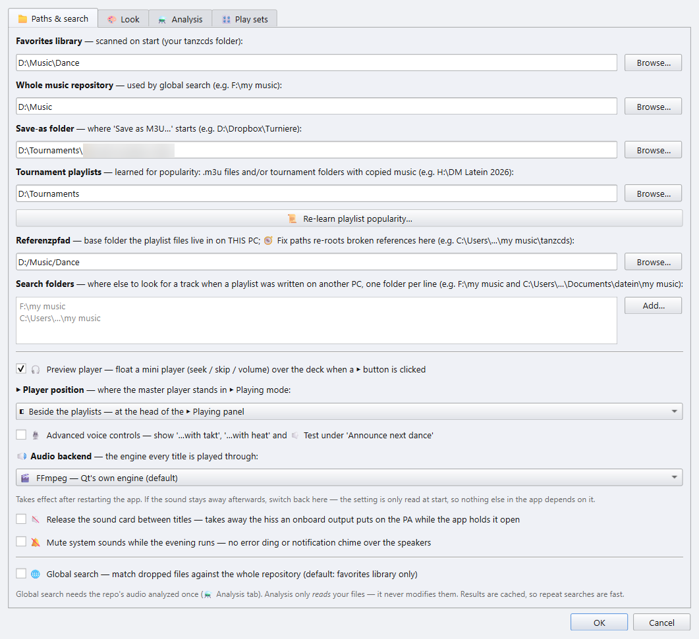

# 1 · Erste Schritte

[Zurück zur Übersicht](README.md)

Wer auf einem Turnier die Musik fährt, plant nichts, sondern lädt eine
fertige Playlist und spielt sie ab: zeitgesteuert, mit dem Paso-Doble-Schnitt, den
gesprochenen Tanzansagen, dem Präsentationsbildschirm und der Cartwall. Der
**DanceSport Player** ist die App für genau diese Aufgabe.

Du bekommst ihn auf zwei Wegen:

- als **Player-Build**, `DanceSport-Player`, ein eigenes Programm für den
  PC in der Halle;
- als volle App im **App-Modus** *Nur Player*, unter ⚙ Einstellungen ▸
  📁 Pfade & Suche ▸ **App-Modus**.

Beide sehen gleich aus und arbeiten gleich. Das Fenster heißt
**DanceSport Player** und öffnet auf der Seite ▶ Wiedergabe.

## Der erste Start

Beim ersten Start öffnet die App mit einem Layout für die Halle:

- keine Playlist-Decks und keine Wunschlisten;
- eine leere **Party**-Liste, bereit für eine `.m3u`, die du darauf ziehst;
- die 📚 Bibliothek offen;
- die 🎛 Cartwall geschlossen;
- das **🎉 Party-Set** an: volle Länge, automatisch weiter, keine Pause,
  angeglichene Lautstärke. Siehe [Abspiel-Sets](04-playing.md#abspiel-sets).

Das passiert nur einmal. Ab dem zweiten Start öffnet die App so, wie du sie
verlassen hast.

## Der App deine Musik zeigen

Öffne ⚙ **Einstellungen**. Der Knopf sitzt unten im Wiedergabe-Bereich. Der
erste Reiter hält die Ordner:

| Feld | Wofür es da ist |
|---|---|
| **Favoriten-Bibliothek** | Dein Turniermusik-Ordner. Er wird bei jedem Start eingelesen und füllt die 📚 Bibliothek. |
| **Speichern-unter-Ordner** | Wo **Speichern als M3U…** beginnt. |
| **Turnier-Playlists** | Deine vorhandenen Turnier-`.m3u`-Dateien. Die Spalte **Pop** zählt, in wie vielen davon ein Titel vorkommt. |
| **Referenzpfad** | Der Ordner, in dem die Musik auf *diesem* PC liegt. Eine Playlist von einem anderen PC wird beim Laden darauf umgehängt, siehe [Kapitel 3](03-playlists.md#playlists-von-einem-anderen-pc). |
| **Suchordner** | Weitere Orte, an denen ein Titel gesucht wird, wenn eine Playlist auf einem anderen PC geschrieben wurde. Ein Ordner pro Zeile. |

Der Rest dieses Reiters steht unter [Einstellungen](06-settings.md).

## Der erste Scan und die Analyse

Beim Start liest die App die Favoriten-Bibliothek ein und zeigt dabei einen
Ladedialog. Titel und Tags werden zwischengespeichert, nur der erste Scan
einer großen Bibliothek dauert also lange.

Drei Funktionen brauchen pro Titel einmal eine kurze Analyse:

- **🔊 Lautstärke angleichen** braucht die Lautheit,
- der **🐂 Paso-Doble-Stopp** braucht die Höhepunkte,
- das Überspringen von Stille am Anfang und Ende braucht die Stillen.

Du startest sie mit **🧱 ALLE Caches aufbauen…** unter ⚙ Einstellungen ▸
⚗ Analyse. Die Analyse *liest* deine Dateien nur und lässt sich abbrechen.
Was schon im Cache liegt, wird wiederverwendet.

### Zu Hause analysieren, in der Halle spielen

Die Analyse braucht Zeit, die du am Turniertag vielleicht nicht hast. Lass sie
zu Hause laufen und kopiere dann `audio_features.db` neben
`DanceSport-Player.exe` auf den PC in der Halle. Der Player liest die
gespeicherten Werte und braucht in der Halle keine Analyse.

## Ein Rundgang durch das Hauptfenster

**Links: die Seitenleiste.** Oben die Player-Karte, darunter der
Wiedergabe-Bereich. Beide beschreibt [Kapitel 4](04-playing.md).

**Oben: die Werkzeugleiste.** Auf schmalen Bildschirmen schrumpfen die Knöpfe
auf ihr Symbol. Fahr mit der Maus darüber, dann siehst du den vollen Namen.

| Knopf | Macht |
|---|---|
| ⊟ Einklappen | Klappt jeden Runden- und Tanzkopf zu. Noch ein Klick öffnet sie wieder. |
| ▴ Decks | Klappt jedes Deck und jede Wunschliste zu einem Reiter ein. |
| 💾 Speichern | Schreibt jedes nicht leere Deck in seine eigene `.m3u`. |
| 📌 Zustand | Speichert jetzt die ganze Sitzung. Das passiert auch von selbst bei jeder Änderung und beim Schließen. |
| 🧹 Leeren | Leert jedes Deck. Wunschlisten bleiben erhalten. |
| ⧉ *n* Playlists | Schaltet durch die Anzahl der Decks auf dem Bildschirm. Ein Rechtsklick geht rückwärts. |
| 🗜 Kompakt | Schaltet die Kopfzeilen durch: voll → kompakt → ohne Gruppen → nummeriert. |
| ⭐ *n* Wunschlisten | Schaltet den Wunschlistenbereich durch: aus → 1 → 2 → 3 → 4 → 2×2. |
| 🤸 Party ▾ | Blendet den Party-Bereich ein oder aus. |
| 📚 Bibliothek | Blendet den Bereich Bibliothek und Turniere ein oder aus. |
| 🎛 Cartwall | Blendet die Wand mit den Sample-Pads ein oder aus. |
| ❔ | Die Übersicht der Tastenkürzel (**F1**). |

**Mitte: die Decks.** Jedes Deck ist eine Playlist, siehe
[Kapitel 3](03-playlists.md).

**Unter den Decks: der Party-Bereich und die Wunschlisten**, und darunter der
Bereich **📚 Bibliothek / 🏆 Turniere**, siehe
[Kapitel 2](02-library-and-tournaments.md).

**Unten:**

- die Knöpfe für Rückgängig und Wiederholen, mit der Zahl der Schritte, die
  sie zurückgehen können;
- der Titel, der im Player bereitliegt;
- die Statusleiste.

Alles, was du siehst, wird beim Arbeiten gespeichert: Decks, Wunschlisten, das
Fensterlayout und was ein- oder ausgeklappt ist. Der nächste Start bringt es
genau so zurück.

## Der Player-Build

Der Player-Build ist etwa 220 MB groß. Gebaut wird er mit
`build_player.bat`; siehe `BUILD.md` im Projekt. Er enthält alles, womit ein
Turnier läuft: Wiedergabe und den Tempo-Regler mit ±16 %, angeglichene
Lautstärke, die Erkennung der Paso-Doble-Höhepunkte, die Stille-Erkennung,
die Cartwall, die Bibliothek und die Ansagen.

Aus der vollen App im Player-Modus gestartet, bietet die App außerdem
**🖨 Drucken**, ein PDF des Ablaufs, und bis zu acht Decks.

Weiter: [Bibliothek und Turniere](02-library-and-tournaments.md)
