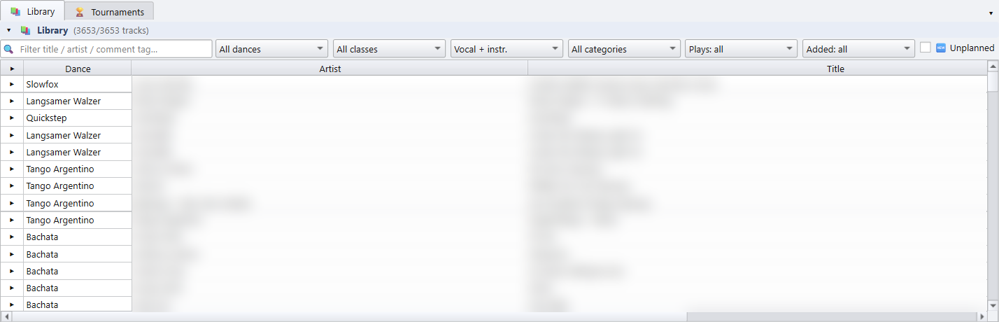
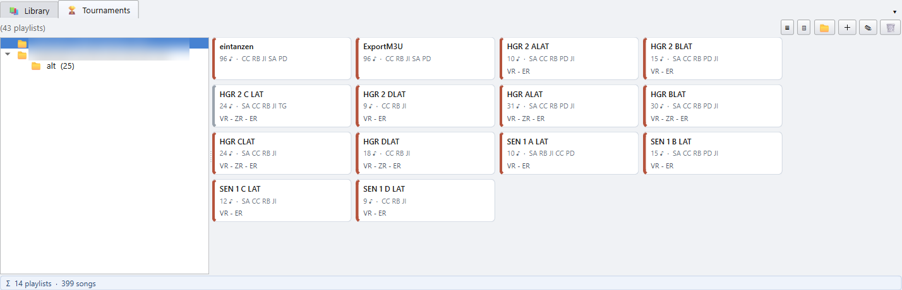
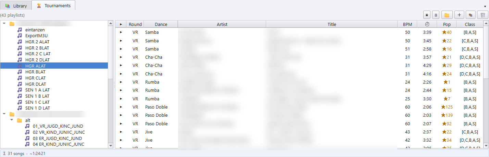

# 2 · Bibliothek und Turniere

[Zurück zur Übersicht](README.md) · zurück: [Erste Schritte](01-getting-started.md)

Der Bereich unter den Wunschlisten hat zwei Reiter. Du blendest ihn mit
**📚 Bibliothek** in der Werkzeugleiste ein oder aus. Zieh den Teiler darüber,
um ihm mehr Platz zu geben.

## 📚 Bibliothek

Die ganze Favoriten-Bibliothek als eine sortierbare Tabelle. Filtere sie und
zieh dann Titel in ein Deck, den Party-Bereich oder eine Wunschliste.

| Filter | Zeigt |
|---|---|
| 🔍 Textfeld | Titel, deren Titel, Interpret oder Kommentar-Tag den Text enthält. Tags sind Markierungen wie `vocal_f`, `classic`, `eintanzen`. |
| Alle Tänze | Einen Tanz, oder alle Standard- oder alle Lateintänze. |
| Alle Klassen | Titel, die zu dieser Startklasse passen. Titel ohne Klassen-Tag erscheinen immer. |
| Gesang + Instr. | Nur 🎤 Titel mit Gesang oder nur 🎻 instrumentale Titel. |
| Alle Kategorien | 🏆 **Nur Turnier** blendet Hymnen, Hintergrundmusik, Dateien mit falschem Tempo, Duplikate und Saison-Ordner aus. Du kannst auch eine dieser Kategorien wählen, was für eine Party praktisch ist. |
| Gespielt: alle | ✦ **Nie gespielt**, ★ **Selten**, ★ **Bewährt** oder 📅 **Seit 1 J. nicht** (gespielt, aber in keiner Playlist des letzten Jahres). |
| Hinzugefügt: alle | Dateien, die in den letzten 30 oder 90 Tagen oder den letzten 12 oder 18 Monaten angelegt wurden. Kombiniert mit ✦ Nie gespielt findest du, was du hineinkopiert, aber nie benutzt hast. |
| 🆕 Ungeplant | Nur Titel, die in keinem der offenen Decks stehen. |

- **▶** in einer Zeile spielt den Titel im Player ab. Die **Leertaste** macht
  dasselbe für die markierte Zeile.
- Ein **Doppelklick** auf eine Zeile öffnet die Datei in deinem externen
  Audioplayer.
- Ein **Rechtsklick** auf eine Zeile bietet **📋 Dateipfad kopieren**,
  **📂 Im Explorer zeigen**, **🎧 In externem Player öffnen**,
  **🏷 MP3-Tags neu einlesen** und **🏷 Tags bearbeiten…**. Sind mehrere
  Zeilen markiert, bearbeitet der Tag-Editor alle. Siehe
  [Kapitel 5](05-tags.md).
- Ein **Rechtsklick auf den Spaltenkopf** wählt die Spalten oder schaltet auf
  kurze Tanznamen (LW, SB) um. Die Spalten **★** (Bewertung) und **Custom**
  sind anfangs ausgeblendet und lassen sich hier einblenden.
  **Custom einem MP3-Tag zuordnen…** füllt Custom aus einem Tag deiner Wahl.

## 🏆 Turniere

Dein Archiv an Turnier-Playlists, so sortiert, wie du über sie denkst: eine
Saison, ein Wochenende, eine Halle, ein Turnier. Die Ordner sind nur
Beschriftungen. Die 🎵 Einträge zeigen auf `.m3u`-Dateien, wo immer diese auf
der Platte liegen.

### Den Baum füllen

- Zieh `.m3u`-Dateien oder einen ganzen Ordner aus dem Explorer auf den Baum.
- **📁** legt einen Ordner an: einen Tag, eine Halle, ein Turnier.
- **＋** fügt dem markierten Ordner Playlist-Dateien hinzu. Rechtsklick auf
  den Baum ▸ **📂 Ordner mit Playlists hinzufügen…** legt einen ganzen Ordner
  von der Platte als Zweig an, mit jeder `.m3u` darunter, genauso wie ein aus
  dem Explorer gezogener Ordner.
- **✎** (oder **F2**) benennt den markierten Eintrag um. **🗑** (oder
  **Entf**) entfernt ihn aus dem Baum. Die Datei auf der Platte bleibt
  unberührt. In der Slot-Ansicht wirken diese auf den gewählten Slot; klick
  auf die Ordnerzeile, um auf den Ordner zu wirken.
- **Strg + A** markiert alles: jeden Slot des Ordners oder in der
  Titel-Ansicht jeden Eintrag des Baums. **Entf** und **🗑** entfernen dann
  nach einer Rückfrage alle markierten Einträge.
- **⊟** klappt jeden Ordner zu, was bei einer langen Saison hilft.
- Aus einem Deck: Rechtsklick ▸ **🏆 Speichern und in „Turniere“ eintragen…**
  speichert die Playlist und legt sie hier ab. Sie kommt in den markierten
  Ordner, neben die markierte Playlist oder an die Wurzel. Der neue Eintrag
  wird sofort gewählt und gezeigt.

### Slot-Ansicht

Wähl links einen Ordner, dann erscheinen rechts seine Playlists als Slots.
Jeder Slot zeigt:

- den Namen der Playlist,
- die Zahl der Titel (♪),
- die Tänze,
- die Runden, die sie enthält (VR = Vorrunde, ZR = Zwischenrunde,
  ER = Endrunde).

- **Zieh einen Slot auf ein Deck**, um diese Playlist dort zu laden. Ziehst
  du einen von mehreren markierten Slots, kommen alle mit; sie gehen in die
  freien Decks, je einer. Ein einfacher Klick verengt die Markierung auf einen
  Slot.
- Ein **Doppelklick auf einen Slot** lädt ihn auf das aktive Deck.
- Ein **Rechtsklick auf einen Slot** bietet ▶ Auf das aktive Deck laden,
  🎵 Seine Titel zeigen, ✎ Umbenennen und 🗑 Aus dem Baum entfernen.

### Titel-Ansicht

**▤** schaltet auf die Titel-Ansicht. Der Baum listet jetzt die Playlists
selbst, und rechts stehen die Titel der gewählten Playlist in
Abspielreihenfolge, mit Runde und Tanz. Runden stehen kurz da, so wie die
Slots sie schreiben (VR, 1ZR, ER). Fahr mit der Maus darüber für den vollen
Namen.

- **▶** oder die **Leertaste** spielt einen Titel ab. Ein Doppelklick öffnet
  ihn in deinem externen Player.
- Zieh Titel auf ein Deck, den Party-Bereich oder eine Wunschliste.
- Die Leiste darunter zeigt die Zahl der Titel und die gesamte Spielzeit.
  Titel, die die Bibliothek nicht kennt, werden mitgezählt, bringen aber keine
  Zeit mit.

**▦** schaltet zurück auf die Slots.

Weiter: [Playlists](03-playlists.md)
