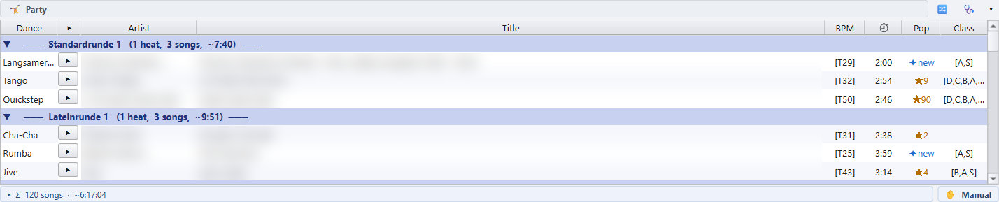

# 3 · Playlists

[Zurück zur Übersicht](README.md) · zurück: [Bibliothek und Turniere](02-library-and-tournaments.md)

Der Player hält seine Musik in drei Arten von Listen:

- die **Decks**, eins pro Turnier oder pro Teil des Abends;
- den **Party-Bereich**, für einen langen Tanzabend;
- die **Wunschlisten**, für Titel, die du griffbereit halten willst.

## Die Decks

**⧉ *n* Playlists** in der Werkzeugleiste legt fest, wie viele Decks auf dem
Bildschirm stehen. Jedes Deck ist ein **Ablauf**: die Titel laufen von oben
nach unten.

- Eine Turnier-Playlist erscheint weiterhin nach Runden und Tänzen
  gegliedert. Ein Klick auf einen Runden- oder Tanzkopf klappt ihn zu.
- Jede Zeile lässt sich überallhin ziehen, auch in ein anderes Deck.
- Ein Titel, den du auf ein Deck ziehst, aus der Bibliothek, einer
  Wunschliste oder dem Explorer, wird dort **eingefügt**, wo du ihn ablegst.
  Er ersetzt nie den Titel, der dort stand.
- **Entf** nimmt die markierten Titel nach einer Rückfrage aus dem Ablauf.
- **Strg + Z / Strg + Y** machen jede Änderung rückgängig und wiederholen sie.
  Die Knöpfe ↶ / ↷ unten zeigen, wie viele Schritte es gibt.
- Ein Doppelklick auf den Decktitel benennt das Deck um. **▾** im Kopf klappt
  das Deck zu einem Reiter ein.

Die Spalten:

- **Tanz / Gruppe**: welcher Tanz und welche Gruppe die Zeile ist.
- **▶**: spielt oder stoppt genau diesen Titel.
- **BPM**: das Tempo in Takten pro Minute, wie es in der Datei steht
  (`[T51]`). `[?BPM]` heißt, die Datei trägt kein Tempo.
- **⏱**: die Länge. Sie ist **orange**, wenn der Titel kürzer ist als die
  Spieldauer oder wenn an einem Rand 5 s oder mehr Stille übersprungen werden.
- **Pop**: `★58` heißt, der Titel steht in 58 deiner Turnier-Playlists.
  **✦neu** heißt, er steht in keiner.
- **Klasse**: die Klassen-Tags aus dem MP3-Kommentar, zum Beispiel `[B,A,S]`.

Zwei weitere Spalten sind anfangs ausgeblendet. Ein Rechtsklick auf den
Spaltenkopf blendet sie ein: **★** bewertet einen Titel mit einem Klick, und
**Custom** hält einen freien Text pro Titel. Beide beschreibt
[Kapitel 5](05-tags.md).

Zeilenfarben:

- eine **orange** Zeile mit ❗ ist markiert, zum Beispiel als Titel, der
  später getauscht werden soll (**Strg + M**);
- ein **roter Titel** mit ❗ zeigt auf eine Datei, die es nicht mehr gibt.

Die Leiste unter dem Deck zeigt die Zahl der Titel **Σ** und die
Gesamtzeit. Ein Klick auf ▸ zeigt die Zahl pro Tanz. Der Schalter
**✋ Manuell / ⏭ Auto** legt fest, ob das Deck von selbst weiterspielt, siehe
[Kapitel 4](04-playing.md#einen-titel-starten).

Ein Rechtsklick auf einen Titel bietet **🏷 MP3-Tags neu einlesen**,
**🏷 Tags bearbeiten…** (siehe [Kapitel 5](05-tags.md)),
**📋 Dateipfad kopieren**, **📂 Im Explorer zeigen** und die Einträge zum
Speichern und Importieren weiter unten.

## 🤸 Der Party-Bereich

Der Party-Bereich hält eine lange Liste für einen Tanzabend. Er sitzt
zwischen den Decks und den Wunschlisten. **🤸 Party ▾** in der
Werkzeugleiste blendet ihn ein oder aus, und **▾** in seinem Kopf klappt ihn
ein.

- Zieh eine `.m3u` auf den Bereich, um sie zu laden. Der Bereich trägt dann
  den Namen der Datei. Ein Turnierablauf, den du hier ablegst, wird in die
  Runden aufgeteilt, in denen er gespielt wird, etwa *Vorrunde* und
  *Finale*.
- Eine in Runden gebaute Liste ist nach ihnen gegliedert, zum Beispiel
  *Standardrunde*, *Lateinrunde* und *Socialrunde*.
- **⇅ Diese beiden Titel tauschen** (Rechtsklick oder **Alt + S**) tauscht
  zwei markierte Titel desselben Tanzes, so behält jede Runde ihre Tänze.

Spielst du aus dem Bereich, schaltet die App von selbst auf das
**🎉 Party-Set**: volle Länge, automatisch weiter, keine Pause, siehe
[Kapitel 4](04-playing.md#abspiel-sets).

## ⭐ Wunschlisten

Eine Wunschliste ist eine flache Liste von Titeln, die du griffbereit halten
willst: Wünsche von der Fläche, ein neues Album, das du ausprobieren willst.

- Zieh Titel aus einem Deck, der Bibliothek oder dem Explorer hinein. Zieh
  sie hinaus auf ein Deck.
- **⭐ n Wunschlisten** in der Werkzeugleiste zeigt bis zu vier Wunschlisten
  oder ein 2×2-Raster.
- Ein Doppelklick auf den Titel benennt sie um. Zieh den Kopf einer
  Wunschliste auf einen anderen, um die beiden zu tauschen.
- Die Leiste darunter zählt die Titel und wie viele davon neu (nie gespielt)
  sind.

**🧹 Leeren** lässt die Wunschlisten stehen.

## Laden und speichern

| Um | Tu |
|---|---|
| eine `.m3u` in ein Deck oder eine Wunschliste zu laden | Rechtsklick ▸ **📂 M3U importieren…**, oder zieh die `.m3u` darauf. Mehrere `.m3u` auf einmal gehen in die freien Decks, je eine. |
| eine Playlist aus deinem Turnierarchiv zu laden | Zieh ihren Slot aus 🏆 Turniere auf ein Deck, siehe [Kapitel 2](02-library-and-tournaments.md#-turniere). |
| das aktive Deck oder die aktive Wunschliste zu speichern | **Strg + S**, oder Rechtsklick auf einen Titel oder den Kopf ▸ **💾 Speichern als M3U…** |
| sie zu speichern und im Baum Turniere abzulegen | Rechtsklick ▸ **🏆 Speichern und in „Turniere“ eintragen…** |
| jedes Deck auf einmal zu speichern | **💾 Speichern** in der Werkzeugleiste. Jede Datei wird nach ihrem Decktitel benannt. |

Beim Import erkennt ein Deck Runden, Tänze und Gruppen von selbst, auch ein
Finale mit zusätzlichen Ersatztiteln. Eine Wunschliste hängt die Titel als
flache Liste an.

## Playlists von einem anderen PC

Eine Playlist-Datei speichert den vollen Pfad jedes Titels. Wurde sie auf
einem anderen PC geschrieben oder liegt die Musik inzwischen auf einem anderen
Laufwerk, stimmen diese Pfade nicht. Der Player repariert sie beim Laden der
Playlist, mit zwei Einstellungen unter
[⚙ Einstellungen ▸ 📁 Pfade & Suche](01-getting-started.md#der-app-deine-musik-zeigen):

- **Referenzpfad**: der Ordner, in dem die Musik auf *diesem* PC liegt;
- **Suchordner**: weitere Orte zum Suchen, einer pro Zeile.

Die App versucht zuerst den Referenzpfad, dann die Suchordner der Reihe nach.
Sie schneidet den alten Pfad von vorn ab, bis der Rest auf eine echte Datei
unter einem davon zeigt. Aus `D:\Musik\tanzcds\lateincd\Samba.mp3` wird so
zum Beispiel `F:\my music\tanzcds\lateincd\Samba.mp3`. Ein Pfad wird nur auf
eine Datei geändert, die es wirklich gibt.

Musste ein Pfad geändert werden, sagt ein Fenster, wie viele Titel umgehängt
wurden und wie viele nicht zu finden waren; **Details anzeigen** listet jeden
alten und neuen Pfad. Ein Titel, der nicht zu finden war, steht rot mit ❗
da. Trag den Ordner, in dem er liegt, unter Suchordner ein und importiere die
Playlist dann noch einmal.

Weiter: [Den Abend fahren](04-playing.md)
