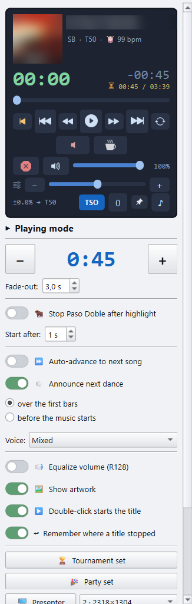
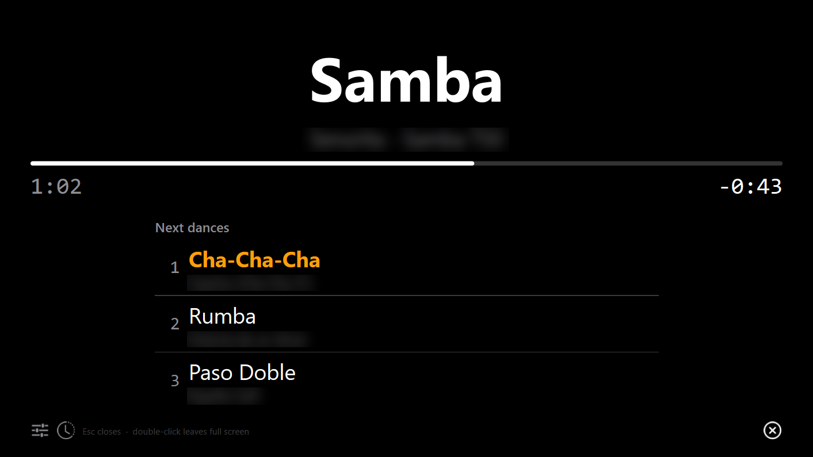
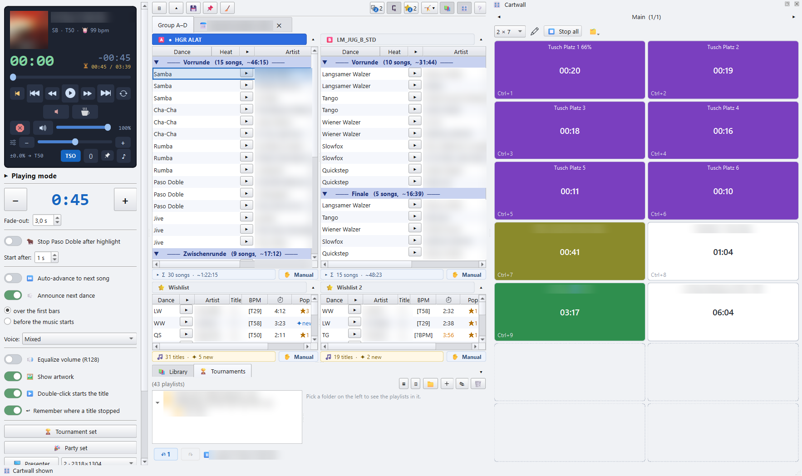

# 4 · Den Abend fahren

[Zurück zur Übersicht](README.md) · zurück: [Playlists](03-playlists.md)

Die Seitenleiste hält die Player-Karte und darunter den Wiedergabe-Bereich.
Du spielst direkt aus den Decks, dem Party-Bereich und den Wunschlisten.

## Einen Titel starten

- **▶** in einer Zeile spielt genau diesen Titel. **■** stoppt ihn.
- Die **Leertaste** pausiert den Player und setzt ihn fort, egal wo der Fokus
  ist, außer in einem Textfeld.
- Ein **Doppelklick** auf eine Zeile startet sie entweder sofort oder legt sie
  nur *bereit*: sie wird geladen und angezeigt, stumm, und ⏯ startet sie. Der
  Schalter dafür ist **▶️ Doppelklick startet den Titel** im
  Wiedergabe-Bereich, siehe unten.
- **Strg + Umschalt + ← / →** springt zum vorigen oder nächsten Titel, und
  **Strg + ← / →** springt 30 s.

Jedes Deck hat in seiner unteren Leiste einen eigenen Schalter
**✋ Manuell / ⏭ Auto**:

- **⏭ Auto**: auf einen fertigen Titel folgt die nächste Zeile, so läuft eine
  ganze Runde ohne Handgriff.
- **✋ Manuell**: du startest jeden Titel selbst. Die gesprochene Ansage ist
  dann ebenfalls aus.

Jede Liste merkt sich ihre eigene Einstellung. Die Partyliste kann von selbst
laufen, während das Turnier-Deck daneben von Hand gestartet wird.

## Die Player-Karte

Die Karte oben in der Seitenleiste zeigt den laufenden Titel, seinen Tanz und
die Restzeit.

| Bedienelement | Macht |
|---|---|
| oranges **\|◀** | Springt zurück auf 0:00 dieses Titels. |
| **⏮ / ⏭** | Voriger / nächster Titel. |
| **◀◀ / ▶▶** | 10 s zurück / vor. |
| **⏯** | Pause / weiter. |
| **🔁** | Wiederholt *diesen* Titel endlos, wenn die Fläche noch voll ist oder eine Rede länger dauert. Das geht auch mit ausgeschaltetem ⏭ Auto. |
| Ausblend-Knopf (durchgestrichener Lautsprecher) | Blendet den Titel jetzt über die Ausblendzeit aus und beendet ihn dann. |
| **☕** | Beendet den Titel und geht direkt zur Pausenmusik. |
| Verlängern-Knopf | Hängt eine weitere Pausenlänge an, wenn der Gruppenwechsel länger dauert. |
| rotes **⊗** | Notfall: blendet die Musik aus und *hält* sie an. Nichts endet und nichts geht weiter. **⏯** setzt genau an dieser Stelle fort. |
| **🔊** | Senkt auf 20 % und wieder auf voll. Die Pausenmusik geht mit herunter. |
| Lautstärkeregler | Gesamtlautstärke. |

Die Tempo-Zeile darunter:

- **Tempo-Regler**: −16 % bis +16 %, ohne die Tonhöhe zu ändern (Time
  Stretch), zum Beispiel um einen Titel auf das Tempo zu ziehen, das das
  Turnier braucht. **− / +** gehen in Schritten, gedrückt gehalten gleiten
  sie. **0** oder ein Doppelklick auf den Regler setzt ihn zurück.
- **TSO**: solange an, wird jeder Titel auf das mittlere Tempo seines Tanzes in
  dieser Runde gezogen, innerhalb des TSO-Bereichs. Eine Rumba mit 23 wird
  T24, ein Paso Doble mit 57 wird T58.
- **📌**: hält das Tempo fest, so bleibt der Regler dort, wo du ihn gelassen
  hast, wenn der nächste Titel startet.
- **♪**: klick im Takt mit, um das tatsächliche Tempo von Hand zu messen. Das
  ist nur eine Anzeige und ändert nichts.

## Der Wiedergabe-Bereich

### Spieldauer und Ausblenden

- Die große Zahl ist die **Spieldauer**: jeder Titel stoppt nach dieser Zeit.
  **− / +** ändern sie in Schritten. Nach dem letzten Schritt läuft der Titel
  bis zu seinem Ende (**komplett**). Ein Doppelklick auf die Zahl lässt dich
  eine genaue Länge eintippen, zum Beispiel `1:37`.
- **Ausblenden**: die Lautstärke fährt über die letzten Sekunden auf 0.

Sobald die Analyse sie gemessen hat, wird Stille am Anfang und Ende eines
Titels übersprungen.

### 🐂 Paso Doble

**🐂 Paso Doble: Stopp am Höhepunkt**: ein Paso Doble wird nicht ausgeblendet.
Er stoppt an einem Höhepunkt, dem musikalischen Break, auf den die Paare
tanzen.

- **Stopp nach Highlight** wählt welchen, meist den 2.
- Die Höhepunkte findet die Analyse. Fehlt einer oder sitzt er falsch, klick
  während des Abspielens genau auf dem Höhepunkt auf
  **🎯 Highlight jetzt markieren**. **✖** vergisst die gelernten Marken dieses
  Titels.
- **✏️ Highlights bearbeiten** pausiert die Musik und setzt den Stopp aus, so
  kannst du durch den ganzen Titel spulen und seine Marken setzen.
- **Start nach** hält einen Paso Doble vor dem Musikstart zurück, damit die
  Paare ihre Ausgangsposition einnehmen können.

Mit ausgeschaltetem Schalter ist ein Paso Doble ein gewöhnlicher Titel.

### Weiter und Pause

- **⏭ Automatisch zum nächsten Titel**: derselbe Schalter wie ⏭ Auto auf dem
  Deck, das du zuletzt angeklickt hast.
- **🔁 Am Ende von vorn beginnen**: nach dem letzten Titel beginnt die Liste
  von vorn. Braucht das automatische Weiterschalten.
- **Pause zwischen den Titeln**: Zeit für die Paare zum Wechseln oder
  Durchatmen. Aus, folgt der nächste Titel sofort.
- **Pausenmusik**: 📂 wählt einen oder mehrere Titel oder eine `.m3u`, die in
  der Pause laufen. ✕ entfernt sie. **Lautstärke Pausenmusik** legt fest, wie
  laut sie spielt.

### 🔈 Nächsten Tanz ansagen

Die App sagt den nächsten Tanz laut an: „Nächster Tanz: Langsamer Walzer“.

- Mit Pause kommt die Ansage kurz bevor die Pause endet.
- Ohne Pause wird der Tanz genannt, wenn der Titel startet: **über den ersten
  Takten** (die Musik wird unter der Stimme leiser) oder **vor dem
  Musikstart** (die Musik folgt der Ansage).
- **Stimme**: Weiblich, Männlich oder Gemischt, was die beiden abwechselt. Ein
  Tanz, der nie aufgenommen wurde, wird nicht angesagt.
- Die Ansage ist deutsch bei deutscher Oberfläche, und bei englischer, wenn
  **Deutsche Tanz- und Rundennamen auch in der englischen Oberfläche**
  angehakt ist. Sonst ist sie englisch („Next dance: Slow Waltz“); eine
  Aufnahme, die bei den englischen fehlt, kommt aus den deutschen.
- Mit der erweiterten Ansagesteuerung (⚙ Einstellungen ▸ 📁 Pfade & Suche)
  fügt **…mit Takt** das Tempo hinzu („…, 29 Takt“) und **…mit Gruppe** die
  Nummer der Gruppe. **🔈 Test** spricht ein Beispiel.

### Klang und Anzeige

- **🔊 Lautstärke angleichen (R128)**: gleicht die Lautheit zwischen den
  Titeln an. Braucht die Lautheitsanalyse.
- **🖼 Cover anzeigen**: ein Cover neben dem Titel im Player. Es nimmt das
  eigene Bild der Playlist (`#EXTIMG`), eine Cover-Datei im Ordner oder das
  Bild in der MP3.
- **▶️ Doppelklick startet den Titel**: an, spielt ein Doppelklick sofort. Aus,
  legt er den Titel nur bereit, und ⏯ startet ihn. Das ist es, was eine Gruppe
  braucht.
- **↩ Merken, wo ein Titel stehen geblieben ist**: ein Titel, den du verlassen
  hast, startet wieder an dieser Stelle. Die Zeile zeigt **↩ mm:ss**. Die
  Marken werden vergessen, wenn die App schließt.

### Abspiel-Sets

Zwei Knöpfe stellen den ganzen Bereich auf einmal um:

- **🏆 Turnier-Set**: 1:40 Spieldauer mit 3 s Ausblenden, keine Pause, kein
  automatisches Weiterschalten, keine Ansage, angeglichene Lautstärke. Es
  leuchtet golden, solange der Bereich auf diesen Werten steht.
- **🎉 Party-Set**: jeder Titel in voller Länge mit 3 s Ausblenden,
  automatisch weiter, keine Pause, keine Ansage und angeglichene Lautstärke.
  Es wird von selbst angewandt, wenn du aus dem 🤸 Party-Bereich spielst, und
  zurückgeschaltet, wenn ein Turnier-Deck übernimmt.

Was jedes Set enthält, legst du selbst fest, unter
[⚙ Einstellungen ▸ 🎛 Spiel-Sets](06-settings.md#spiel-sets).

### 🖥 Präsentation

**🖥 Präsentation** öffnet ein zweites Vollbildfenster für einen Beamer oder
einen Monitor, der zur Fläche zeigt. Es zeigt den laufenden Titel mit seinem
Tanz und die nächsten drei Titel.

- Das Feld daneben wählt den Bildschirm.
- **🎨 Design**: *Default* ist die schwarze Hallenanzeige. *Light* ist cremefarbenes
  Papier mit warmer brauner Schrift, für einen hellen Raum.
- **🕒** hält einen Zeitplan für den Abend, etwa Essen oder den
  Eröffnungstanz. Er ist eine zweite Seite der Präsentation. **T** schaltet
  dort zwischen den Seiten um.
- **Esc** schließt die Präsentation. Ein Doppelklick darauf verlässt den
  Vollbildmodus.

**☀ Bildschirm wach halten** hält Bildschirmschoner und Bildschirm-Abschaltung
auf, solange Musik läuft oder die Präsentation offen ist.

## 🎛 Die Cartwall

**🎛 Cartwall** in der Werkzeugleiste zeigt eine Wand aus Sample-Pads:
Fanfaren, ein Trommelwirbel, die Nationalhymne, ein Jingle für die
Siegerehrung.

- Ein **Klick auf ein Pad** feuert es über die laufende Musik. Noch ein Klick
  blendet es aus.
- **Strg + 1 … 9** feuern die ersten neun Pads der sichtbaren Seite.
- **⏹ Alles stoppen** oder **Esc** blendet jedes Pad aus.
- **✏** entsperrt die Wand zum Bauen. Zieh Audiodateien auf ein Pad, um es zu
  füllen. Eine Mehrfachauswahl füllt die freien Pads danach. Zieh ein Pad auf
  ein anderes, um die beiden zu tauschen. Sperr die Wand vor dem Turnier
  wieder, damit nichts aus Versehen verrutscht.
- Ein **Rechtsklick auf ein Pad** bietet seine 🎨 Farbe oder
  **⚙ Einstellungen…** für Beschriftung, Lautstärke, eigene Taste,
  🔁 endlose Wiederholung und ob es die Musik leiser macht.
- Die Seitenpfeile schalten die Seiten um. Ein Doppelklick auf den Seitennamen
  benennt die Seite um. Das Größenfeld legt das Raster fest, zum Beispiel
  2 × 7. Ein kleineres Raster verliert nie ein Pad.
- **🗂** exportiert oder importiert die Wand oder packt alle Pads auf eine
  Seite.
- Zieh die Wand links oder rechts ans Fenster, unter die Decks oder als
  eigenes Fenster hinaus. **📌** holt eine schwebende Wand zurück.

Weiter: [Tags](05-tags.md)
